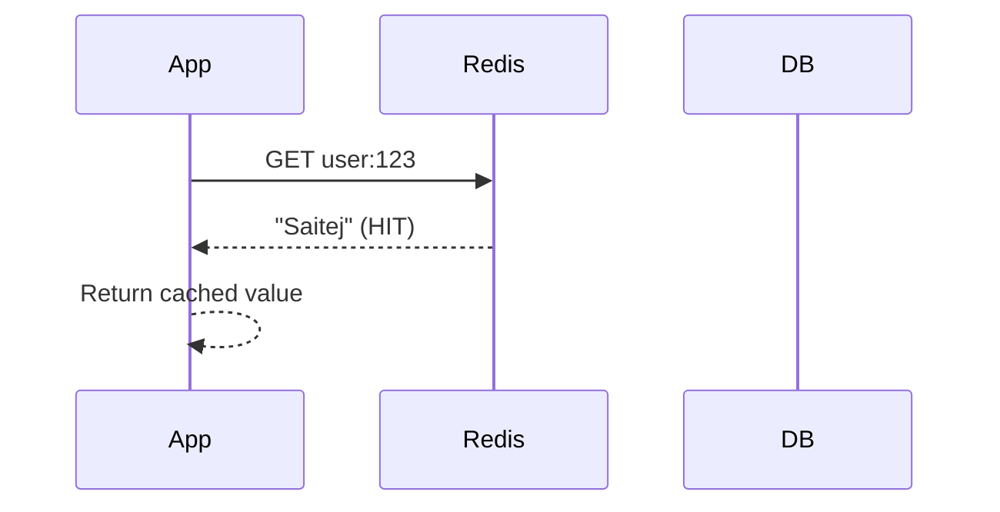
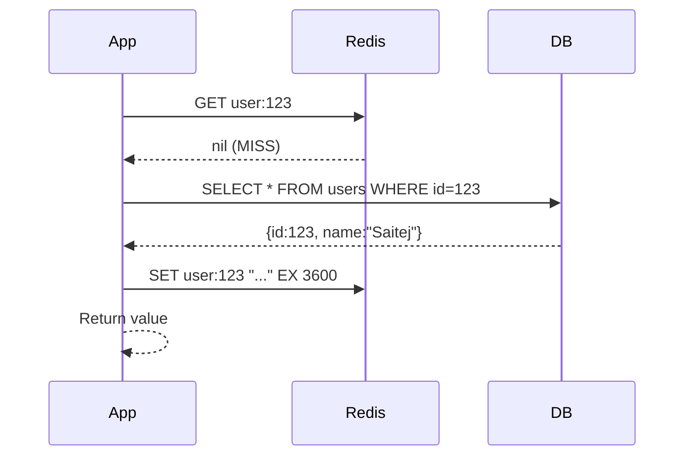
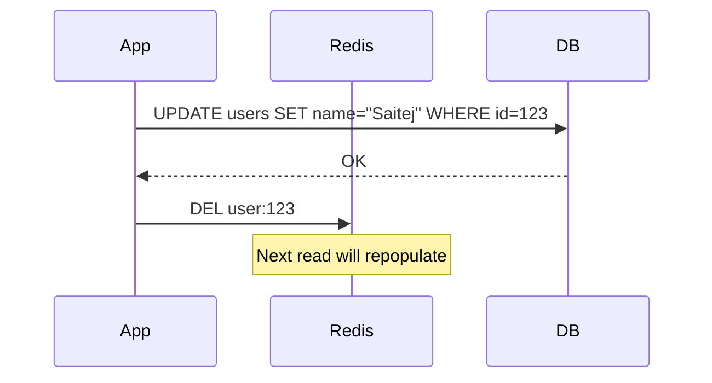
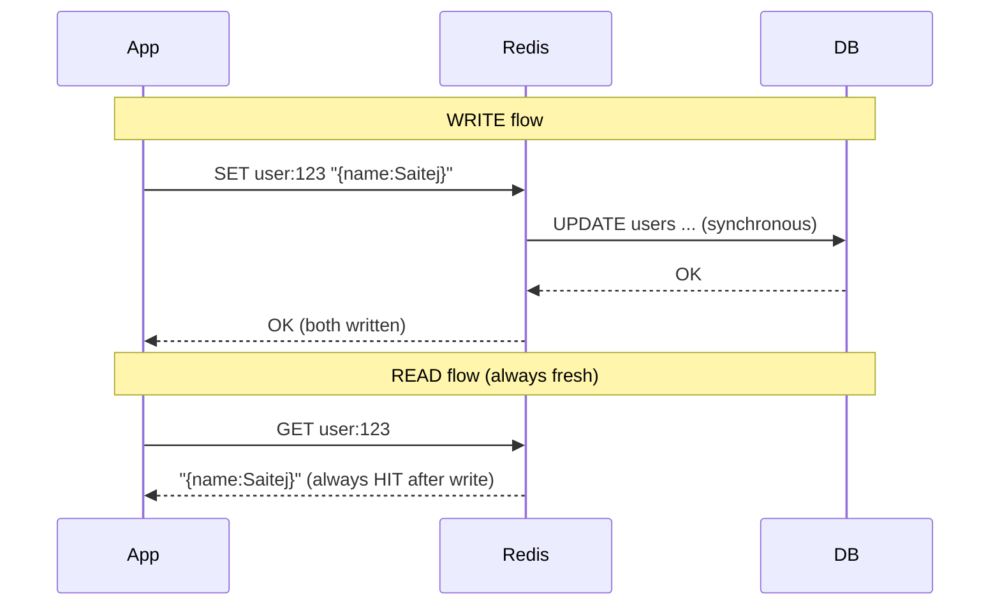
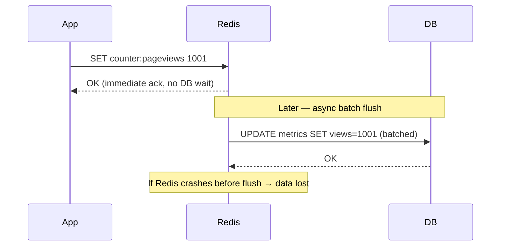
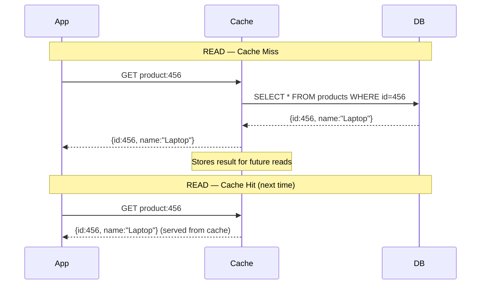
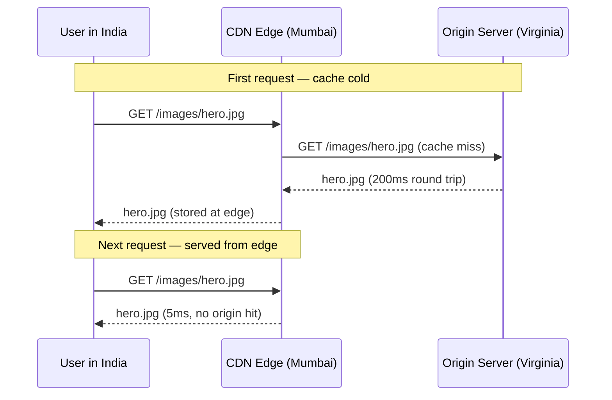

# Caching Fundamentals

## Why Cache

Reading from Postgres: ~50ms. Reading from Redis: ~1ms. That's a 50x improvement.

Databases store data on disk — every query pays the cost of disk I/O. Memory sits much closer to the CPU and avoids that entirely. Caches reduce load on the database and cut latency dramatically.

**When to bring up caching in a design:**
- Read-heavy workload (millions of daily reads hitting DB)
- Expensive queries (joins, aggregations taking 200ms+)
- High database CPU during peak
- Latency requirements under 10ms that DB can't meet

Don't jump straight to caching. Establish the bottleneck first, quantify it, then introduce the cache.

---

## Where to Cache

### 1. External Cache (Redis / Memcached)

The most common. A standalone cache service your application calls over the network. Every application server shares the same cache. Supports LRU eviction and TTL expiry.

**Default answer for any system design interview.**

```
App Server → Redis → (on miss) → Database
```

### 2. CDN (Content Delivery Network)

Geographically distributed edge servers that cache content close to users. Instead of requests traveling to your origin server, a CDN serves from a nearby edge.

- Without CDN: User in India → Virginia server = 250–300ms
- With CDN: User in India → Mumbai edge = 20–40ms

CDNs are a form of **read-through cache** — on a miss, the CDN fetches from origin, caches, and returns.

Best for: static media (images, videos, JS/CSS) at scale. Modern CDNs (Cloudflare, Fastly) can also cache API responses.

### 3. Client-Side Cache

Data stored on the user's device — browser HTTP cache, localStorage, mobile app local storage. Also applies to Redis client libraries that cache cluster topology (which nodes own which slots) to route requests directly.

Limited control from backend. Stale data is harder to invalidate. Good for offline support (e.g., Strava caches run data on device while offline).

### 4. In-Process Cache (Application Memory)

Cache data directly inside the application process — no network call at all. Even faster than Redis.

Best for small, rarely-changing, frequently-read data:
- Feature flags
- Config values
- Hot keys
- Rate limit counters
- Small reference datasets

**Limitation:** Each app instance has its own cache. Updates on one server don't propagate to others.

Use as an **optimization layer on top of Redis**, not a replacement.

---

## Cache Architectures (Read/Write Patterns)

### Cache-Aside (Lazy Loading) — DEFAULT

The most common pattern. **Always default to this in interviews.**

Only caches data that's actually needed. Cache miss adds latency on first read. Simple to implement, works with any cache.

**READ flow — Cache Hit:**



**READ flow — Cache Miss:**



**WRITE flow:**



---

### Write-Through

Application writes to the cache; cache synchronously writes to DB before returning.

**Pros:** Cache is always consistent with DB.
**Cons:** Slower writes (must wait for both). Can pollute cache with unread data. Still has dual-write failure risk.

Use when: reads must always return fresh data and your system can tolerate slower writes.

Redis doesn't natively support write-through — you need application logic or a framework.



---

### Write-Behind (Write-Back)

Application writes to cache only. Cache batches and asynchronously writes to DB in background.

**Pros:** Very fast writes.
**Cons:** Risk of data loss if cache crashes before flush.

Use when: high write throughput needed and eventual consistency is acceptable (analytics pipelines, metrics).



---

### Read-Through

Cache acts as a smart proxy. On a miss, the cache itself fetches from DB, stores, and returns. Application never talks directly to the DB.

CDNs are the most common example. For application-level caching with Redis, cache-aside is more common. Rarely proposed in interviews unless discussing CDN-like infrastructure.



---

### CDN as Read-Through (Real-World Example)



---

## Cache Eviction Policies

When cache memory is full, which entry to remove?

### LRU (Least Recently Used)
Evict the item not accessed for the longest time. Uses a linked list to track access order — O(1) eviction. **Default in most systems.** Adapts to workloads where recently used data is likely used again.

### LFU (Least Frequently Used)
Evict the item accessed the fewest times. Maintains a counter per key. Good when some keys are consistently hot over time (trending videos, top playlists). More expensive to implement precisely — many systems use approximate LFU.

### FIFO (First In First Out)
Evict the oldest item based on insertion time only. Ignores usage patterns. Rarely used in real systems — may evict still-hot data.

### TTL (Time To Live)
Not a standalone eviction policy — sets an expiration time per key. Combined with LRU/LFU. Essential when data must periodically refresh (API responses, session tokens, feed snapshots).

---

## Common Cache Problems

### Cache Stampede (Thundering Herd)

When a popular cache entry expires, many concurrent requests miss the cache simultaneously and all hit the database at once. Can overwhelm the DB.

**Example:** Homepage feed cached with 60s TTL. At 12:01:00 it expires. 1000 concurrent users hit the DB at the same moment.

**Solutions:**
- **Request coalescing (single-flight):** Only one request rebuilds the cache; others wait for the result. Most effective.
- **Cache warming:** Proactively refresh keys before expiry (only helps with TTL-based expiration, not write-invalidation).
- **Probabilistic early expiration:** Re-fetch slightly before TTL expires to avoid simultaneous misses.
- **Jitter on TTL:** Add random variance so keys don't all expire at the same moment.

### Cache Consistency / Staleness

Cache and database can diverge. Write updates DB but cache still has old value → users see stale data.

**Solutions:**
- **Invalidate on write:** Delete cache key after writing to DB. Next read repopulates with fresh data. Most common.
- **Short TTL:** Accept slight staleness; cache auto-refreshes frequently.
- **Accept eventual consistency:** For feeds, metrics, analytics — a 60-second lag is usually fine.

No perfect solution. Choose based on how fresh data must be.

### Hot Keys

A single cache key receives disproportionate traffic. Can overload one Redis node/shard even with a high overall hit rate.

**Example:** Taylor Swift's user profile (user:taylorswift) gets millions of requests/second. One Redis shard gets hammered.

**Solutions:**
- **Replicate hot keys across multiple nodes:** Store same value on multiple shards, load-balance reads.
- **In-process cache as a fallback:** Keep the hottest keys in-process to avoid hitting Redis at all.
- **Rate limiting:** Throttle abusive traffic patterns on specific keys.

---

## Caching Decision Framework (Interview)

**Step 1 — Identify the bottleneck:**
"User profile queries hit the DB 500 times/sec during peak. Each takes 30ms. That's our bottleneck."

**Step 2 — Decide what to cache:**
Cache what is read frequently, changes rarely, and is expensive to compute.
- User profiles (read every page load, updated rarely)
- Trending feed (expensive aggregation, fine to be 60s stale)
- Session tokens
- Config/feature flags

**Step 3 — Choose architecture:**
Default: cache-aside. State why: simple, lazy-loads, works with Redis.

**Step 4 — Set eviction policy:**
"LRU eviction + 10-minute TTL on user profiles. On profile update, delete the cache key immediately."

**Step 5 — Address downsides:**
- Invalidation: "Delete on write for user data; TTL for feeds."
- Stampede: "Single-flight for popular keys."
- Failure: "Circuit breaker to stop DB overload if Redis goes down. In-process fallback for hottest keys."

---

## Strategy Comparison: When to Use What

### Side-by-Side

| Dimension | Cache-Aside | Write-Through | Write-Behind | Read-Through |
|---|---|---|---|---|
| Who loads cache? | Application on miss | Application on write | Application on write | Cache itself on miss |
| Who writes DB? | Application directly | Cache (sync) | Cache (async batch) | Application directly |
| Consistency | Eventual (stale until invalidated) | Strong (always fresh) | Eventual (async lag) | Eventual |
| Write speed | Fast | Slower (wait for both) | Very fast | Fast |
| Read speed | Fast after first miss | Fast (always cached) | Fast | Fast after first miss |
| Data loss risk | None | Low (dual-write edge case) | High (cache crash) | None |
| Cold start | Yes (empty cache = all misses) | No (every write populates) | No | Yes |
| Cache pollution | No (only caches what's read) | Yes (caches everything written) | Yes | No |
| Implementation complexity | Low | Medium | High | Medium |

---

### Detailed Decision Guide

#### Use Cache-Aside when:
- **You want the simplest thing that works** — default choice for 90% of use cases
- Data is read much more than written (user profiles, product catalog, config)
- Some staleness is acceptable (invalidate on write or rely on TTL)
- You want the cache to only hold data that's actually being requested
- You're using Redis directly (not a caching framework)

**Real examples:** User profiles, product pages, search results, session data, feed snapshots

```
User reads profile → check Redis → miss → read Postgres → write Redis → serve
User updates profile → write Postgres → DELETE Redis key
```

#### Use Write-Through when:
- **Reads must always return fresh data** (no stale reads tolerable)
- Write volume is moderate (not millions/sec — every write hits both cache and DB)
- You're using a caching framework/library that supports write-through natively
- Read:write ratio is close to 1:1 or read-heavy with freshness requirements

**Real examples:** Banking balances (must always be fresh), inventory counts, user settings that immediately affect behavior

**Warning:** Still has the dual-write failure problem. If cache write succeeds but DB write fails (or vice versa), you have inconsistency. Need retry logic or compensation.

#### Use Write-Behind when:
- **Maximizing write throughput** is the primary goal
- You can tolerate losing some recent writes on cache failure (analytics events, metrics, non-critical counters)
- Data is written frequently but read less often
- You're batching writes for efficiency (e.g., write 1000 events to DB in one batch instead of 1000 individual writes)

**Real examples:** Page view counters, click tracking, real-time analytics pipelines, game scores (approximate is fine)

**Warning:** Never use for financial transactions, order records, or anything where data loss is unacceptable.

#### Use Read-Through when:
- You want to centralize cache-miss logic away from application code
- You're behind a CDN or gateway (it IS read-through by nature)
- Using a caching library that supports it (Caffeine with loader, Spring @Cacheable)
- You want cache hydration to be invisible to callers

**Real examples:** CDN for media delivery, @Cacheable in Spring Boot, Caffeine with async loader

```kotlin
// Spring @Cacheable is effectively read-through
@Cacheable("users")
fun getUser(id: String): User = userRepository.findById(id)
// First call: hits DB, caches result
// Subsequent calls: returns from cache transparently
```

---

### Decision Tree

```
What's your primary concern?
│
├── Simplicity + works for most cases
│   → Cache-Aside
│
├── Cannot serve stale reads
│   → Write-Through
│   (be aware: slower writes, dual-write risk)
│
├── Maximum write throughput, some loss OK
│   → Write-Behind
│   (never for financial/critical data)
│
├── Want cache miss logic hidden from app code
│   → Read-Through
│   (or just use @Cacheable / CDN)
│
└── Static media / public content
    → CDN (it's read-through by design)
```

---

### Common Hybrid Patterns

**Cache-Aside reads + Write-Through writes** (most balanced)
Cache is always warm after writes. Reads serve from cache-aside. Good for user-facing data that's read far more than written.

**Cache-Aside + TTL only** (simplest, eventual consistency)
No explicit invalidation. Just let keys expire. Acceptable when data can be 1–60 seconds stale. Feeds, recommendations, trending data.

**Write-Behind + Read-Through** (maximum performance, highest risk)
All reads and writes go through cache. DB sees batched, async writes. Used in high-performance gaming or analytics where speed trumps durability.

**Multi-layer: In-process (L1) + Redis (L2) + DB**
Hot keys served from process memory in <0.1ms. Cache-aside for L1, cache-aside for L2. Used for extremely high-traffic keys (Taylor Swift's profile, viral post metadata).

```
Request → L1 (in-process, ~0.1ms) → miss
        → L2 (Redis, ~1ms) → miss
        → DB (Postgres, ~10ms) → write to both L2 and L1
```

---

### Quick Reference by Data Type

| Data Type | Strategy | TTL | Invalidation |
|---|---|---|---|
| User profile | Cache-Aside | 1 hour | Delete on update |
| Product catalog | Cache-Aside | 5 minutes | Delete on update |
| Session token | Cache-Aside | Match session expiry | Delete on logout |
| Homepage feed | Cache-Aside | 60 seconds | TTL only (eventual ok) |
| Search results | Cache-Aside | 5 minutes | TTL only |
| Config / feature flags | In-process | 30 seconds | Poll or pub/sub |
| Rate limit counters | Write-Behind or direct Redis | Window duration | Expire naturally |
| Leaderboard | Cache-Aside or direct Redis ZSet | 30 seconds | ZINCRBY in-place |
| Media / images | CDN (Read-Through) | Days to weeks | Purge on update |
| Analytics events | Write-Behind | N/A (no cache reads) | N/A |
| Bank balance | Write-Through or no cache | Short or none | Invalidate on txn |
