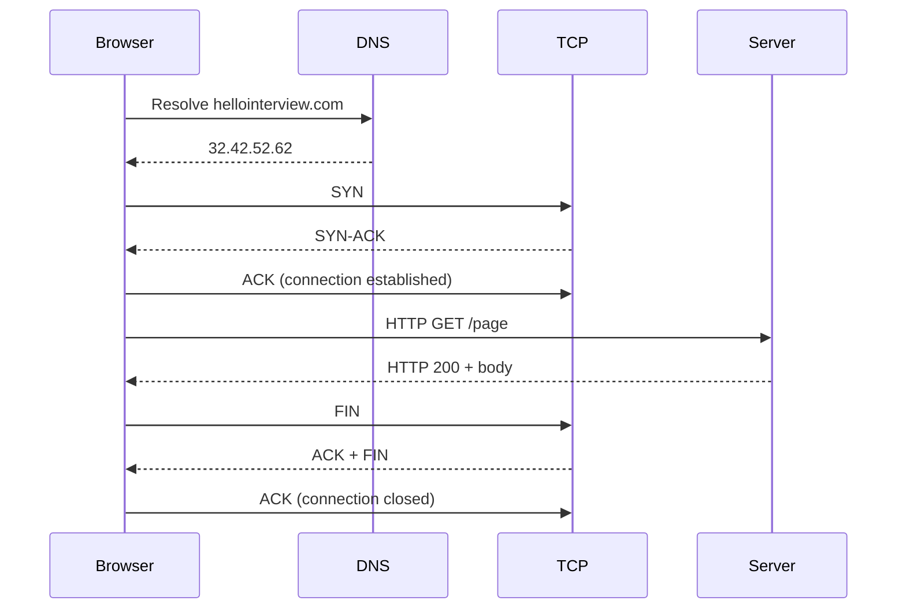
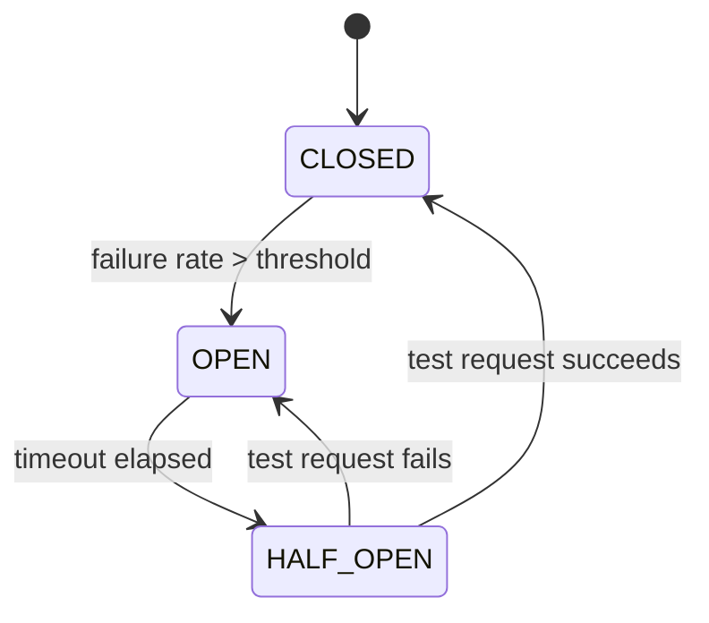

# Networking Essentials

## The OSI Model (What You Actually Need)

The full OSI model has 7 layers. Three matter for system design:

| Layer | Name | Protocols | What it does |
|---|---|---|---|
| 3 | Network | IP | Routing, addressing, packet forwarding |
| 4 | Transport | TCP, UDP, QUIC | End-to-end communication, reliability |
| 7 | Application | HTTP, DNS, WebSocket, gRPC | App-specific data exchange |

**Mental model:** Each layer is an abstraction. As an app developer you work at L7 and take L3/L4 for granted. A load balancer at L4 sees IP+port only. A load balancer at L7 sees HTTP headers and URLs.

---

## How a Web Request Actually Works



Key observations:
- Multiple round trips happen before any app data flows (DNS + TCP handshake)
- TCP connection is **stateful** — both sides must maintain it
- Without keep-alive or HTTP/2 multiplexing, this repeats for every request
- HTTP/2 uses multiplexing (multiple requests over one TCP connection)
- HTTP/3 uses QUIC (UDP-based, eliminates TCP handshake latency)

---

## TCP vs UDP

### TCP — The Workhorse

**Connection-oriented.** Three-way handshake before data. Guarantees delivery, ordering, and no duplicates.

**Mechanism:**
- **Sequence numbers:** Every byte is numbered. Receiver sends ACK for what it got.
- **Retransmission:** If ACK doesn't arrive in time, sender retransmits.
- **Flow control:** Receiver advertises a "window size" — how much data it can buffer. Sender throttles.
- **Congestion control:** Detects network congestion (dropped packets) and reduces send rate. Algorithms: Reno, CUBIC, BBR.

**When to use:** Everything that needs reliability — HTTP, database connections, file transfer. Default choice.

**Cost:** ~1 RTT for handshake. ~4 packets for teardown. Header is 20-60 bytes vs UDP's 8 bytes.

### UDP — Spray and Pray

**Connectionless.** No handshake. No ordering. No retransmission. Just fire packets and hope.

**When to use:**
- Real-time: gaming, VoIP, live video (occasional packet loss is OK, delay is not)
- DNS lookups (single request-response, timeout + retry is fine)
- High-volume telemetry where loss is acceptable
- WebRTC (audio/video)

**Note:** Browsers don't support raw UDP. For browser clients needing UDP-like behavior, use WebRTC.

### QUIC (HTTP/3)

UDP-based transport that combines TCP reliability + TLS 1.3 in one handshake. Eliminates head-of-line blocking (separate streams per request). Used by Google, Cloudflare. Becoming standard but not yet ubiquitous.

---

## Application Layer Protocols

### HTTP/1.1
- Request-response over TCP
- Text-based headers
- One request at a time per connection (pipelining is broken in practice)
- Keep-Alive: reuses TCP connection across requests
- **Bottleneck:** Head-of-line blocking — request N waits for N-1 to complete

### HTTP/2
- Binary framing (more efficient parsing)
- **Multiplexing:** Multiple requests in parallel over ONE TCP connection via streams
- Header compression (HPACK)
- Server push (rarely useful in practice)
- **Still has TCP head-of-line blocking** — a lost TCP packet blocks all streams

### HTTP/3
- Runs on QUIC (UDP-based)
- No TCP head-of-line blocking — each stream is independent
- Combined TLS+transport handshake = 1 RTT (vs 2-3 for TCP+TLS)
- Better on mobile/lossy networks

### REST
Default for external APIs. Resources + HTTP verbs. Stateless. JSON. Well-understood.

```
GET  /users/123         → get user
POST /users             → create user  
PUT  /users/123         → update user
DEL  /users/123         → delete user
GET  /users/123/posts   → nested resource
```

Use by default. Switch to GraphQL if clients need flexible queries. Switch to gRPC for internal high-throughput services.

### gRPC
- HTTP/2 + Protocol Buffers (binary, compact, typed)
- Schema-first: `.proto` files generate client+server stubs
- 10x throughput vs REST/JSON in benchmarks
- Strong typing catches errors at compile time
- Supports streaming (unary, server-streaming, client-streaming, bidirectional)

**Use for:** Internal service-to-service communication where performance matters. Not for public APIs (no browser support).

### WebSockets
- Starts as HTTP, upgrades to persistent bidirectional TCP connection
- Both client and server can push messages anytime
- Full duplex — simultaneously send and receive
- **Stateful:** server must remember which connection belongs to which user

**Use when:** Real-time bidirectional: chat, collaborative editing, live game state, trading feeds.
**Not for:** One-directional server-to-client only (use SSE). Request-response only (use HTTP).

### SSE (Server-Sent Events)
- HTTP response that never ends — server keeps streaming chunks
- Unidirectional: server → client only
- Browser has `EventSource` API; auto-reconnects with last event ID
- Works through standard HTTP infrastructure (no special firewall rules)

**Use when:** Server needs to push updates to client: auction prices, notifications, live scores.
**Limitation:** Some proxies buffer and break it. One-way only.

### WebRTC
- Peer-to-peer, UDP-based (SRTP/DTLS)
- Browser-to-browser without a server for data path
- Requires signaling server (STUN/TURN) for connection setup
- NAT traversal via STUN (direct) or TURN relay (fallback)

**Use only for:** Audio/video conferencing. Not for general real-time features.

---

## Protocol Selection Guide

| Need | Protocol |
|---|---|
| Standard API | REST/HTTP |
| Internal microservices, high throughput | gRPC |
| Server pushes to client (notifications) | SSE |
| Real-time bidirectional (chat, games) | WebSocket |
| Audio/video conferencing | WebRTC |
| DNS | UDP |
| Real-time gaming/streaming (mobile app) | UDP |
| Everything else | TCP |

---

## Load Balancing

### Why

Single server = SPOF + limited capacity. Multiple servers = need to distribute requests.

### Client-Side Load Balancing

Client gets a list of servers and picks one itself. Used by:
- Redis Cluster clients (hash slot → node)
- gRPC (built-in round-robin or custom policy)
- DNS (returns multiple A records, client picks)

**Pro:** No extra network hop. **Con:** Client needs up-to-date server list.

### Dedicated Load Balancer (L4)

Operates at TCP/IP layer. Routes based on IP + port only. Doesn't inspect HTTP.

- Maintains persistent TCP connection between client and server
- Fast (minimal packet inspection)
- Perfect for WebSockets (connection must stick to same backend)
- Cannot route based on URL, headers, cookies

**Use for:** WebSocket connections, raw TCP services.

### Dedicated Load Balancer (L7)

Operates at HTTP layer. Can inspect URLs, headers, cookies. Terminates connection, creates new one to backend.

- Route `/api` to API servers, `/static` to file servers
- Sticky sessions via cookie
- Health checks via HTTP (check `/health` returns 200)
- More CPU-intensive than L4

**Use for:** HTTP/HTTPS traffic (the default). Everything except WebSockets.

### Algorithms

- **Round Robin:** Requests distributed in rotation. Simple, good for stateless apps.
- **Least Connections:** Route to server with fewest active connections. Good for WebSockets/SSE.
- **IP Hash:** Same client IP always goes to same server. Session affinity without cookies.
- **Least Response Time:** Route to fastest responding server.

### Health Checks

Load balancers poll backends (TCP or HTTP) at intervals. If a backend fails, stop routing to it. This gives automatic failover without code changes.

---

## Handling Failures

### Timeouts
Set timeouts on every network call. Without timeouts, one slow service holds threads indefinitely.

```
connectTimeout: 100ms
readTimeout: 1000ms  
```

### Retries + Exponential Backoff + Jitter

```kotlin
fun retryWithBackoff(maxAttempts: Int = 3, block: () -> Response): Response {
    var attempt = 0
    var delay = 100L
    while (attempt < maxAttempts) {
        try {
            return block()
        } catch (e: TransientException) {
            attempt++
            val jitter = Random.nextLong(0, delay / 2)
            Thread.sleep(delay + jitter)
            delay = minOf(delay * 2, 30_000L)  // cap at 30s
        }
    }
    throw MaxRetriesExceededException()
}
```

**Magic phrase for interviews:** "retry with exponential backoff and jitter."

Only retry **idempotent** operations. Use idempotency keys for non-idempotent (payments, order creation).

### Circuit Breaker

States: CLOSED (normal) → OPEN (failing, fast-fail) → HALF-OPEN (testing recovery)



**Why:** Prevents cascading failures. If DB is down, don't hammer it with retries — fast-fail immediately and give it time to recover.

---

## Latency Numbers

| Operation | Latency |
|---|---|
| Same datacenter network round trip | ~0.5ms |
| NYC → London (speed of light) | ~80ms |
| NYC → Singapore | ~180ms |
| DNS resolution (cached) | ~1ms |
| DNS resolution (uncached) | ~20-120ms |
| TCP handshake (local) | ~1ms |
| TLS handshake (additional) | ~1 RTT |
| HTTP/1.1 request (local) | ~2ms |
| HTTP/3 vs HTTP/1.1 on lossy network | 30% faster |


---

## Related

[[02 - Tomcat Threads and Connection Pools]]
