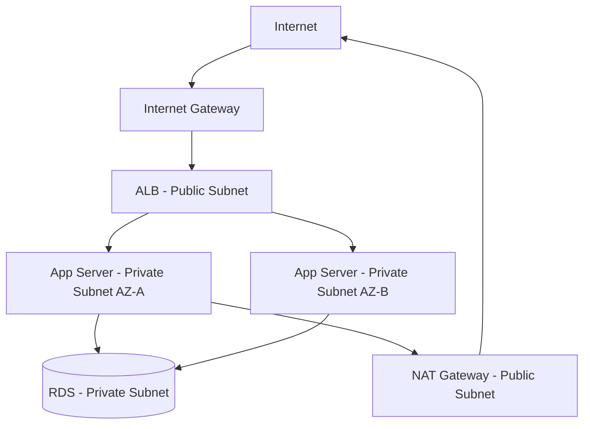

# AWS Networking

## VPC (Virtual Private Cloud)

A VPC is your **isolated virtual network** within AWS. Think of it as your own data center network inside AWS — you define IP ranges, routing, firewall rules.

```
AWS Region (us-east-1)
  └── VPC (10.0.0.0/16 = 65,536 IPs)
        ├── Availability Zone A (us-east-1a)
        │     ├── Public Subnet (10.0.1.0/24)   ← internet-facing
        │     └── Private Subnet (10.0.2.0/24)  ← internal only
        ├── Availability Zone B (us-east-1b)
        │     ├── Public Subnet (10.0.3.0/24)
        │     └── Private Subnet (10.0.4.0/24)
        └── Availability Zone C (us-east-1c)
              ├── Public Subnet (10.0.5.0/24)
              └── Private Subnet (10.0.6.0/24)
```

### Public vs Private Subnets

**Public subnet:** Has a route to an **Internet Gateway**. Resources can have public IPs. Accessible from the internet.

**Private subnet:** No route to internet gateway. Resources have only private IPs. Not directly reachable from internet. Use **NAT Gateway** for outbound internet access.

**Typical architecture:**
- **Public subnets:** Load balancers, bastion hosts, NAT gateways
- **Private subnets:** App servers, databases, cache clusters



---

## Security Groups vs NACLs

### Security Groups (Stateful Firewall)

Attached to **EC2 instances / ENIs**. Controls inbound/outbound traffic at the instance level.

**Stateful:** If you allow inbound port 8080, the response traffic is automatically allowed outbound (connection tracking).

```
Security Group: web-servers
Inbound:
  Type     Protocol  Port   Source
  HTTP     TCP       80     0.0.0.0/0 (anywhere)
  HTTPS    TCP       443    0.0.0.0/0
  SSH      TCP       22     10.0.0.0/8 (internal only)

Outbound:
  All traffic → 0.0.0.0/0 (allow all by default)
```

**Best practice:** 
- Don't allow 0.0.0.0/0 inbound except for LB
- Reference security groups instead of IPs: "allow from alb-sg on port 8080"

### NACLs (Network ACL — Stateless Firewall)

Attached to **subnets**. Evaluates every packet independently (no connection tracking).

**Stateless:** Must explicitly allow both inbound AND return traffic.

```
NACL: private-subnet
Inbound:
  Rule  Type      Protocol  Port     Source            Action
  100   HTTP      TCP       8080     10.0.1.0/24       ALLOW
  200   Ephemeral TCP       1024-65535 0.0.0.0/0      ALLOW  ← response traffic!
  *     All       All       All      0.0.0.0/0         DENY

Outbound:
  100   All       All       All      0.0.0.0/0         ALLOW
```

**Use NACLs for:** Broad subnet-level blocking (block a bad IP range for all resources in subnet). Security Groups for fine-grained per-resource rules.

---

## AWS Load Balancers

### ALB (Application Load Balancer) — L7

```
Internet → ALB (L7) → Target Group A (EC2, ECS, Lambda)
                   → Target Group B (different path)
```

**Features:**
- HTTP/HTTPS routing
- Path-based routing: `/api` → target-group-api, `/static` → target-group-static
- Host-based routing: `api.example.com` → API servers, `app.example.com` → web servers
- WebSocket support (with sticky sessions)
- WAF integration (AWS Web Application Firewall)
- Lambda targets
- Authentication via Cognito/OIDC

**Listener rules:**
```
Rule 1: IF path = /api/*      → forward to api-servers-tg
Rule 2: IF path = /health     → return 200 (fixed response)
Rule 3: IF Host = admin.*     → authenticate via Cognito → forward to admin-tg
Rule 4: Default               → forward to web-servers-tg
```

### NLB (Network Load Balancer) — L4

- Routes TCP/UDP by IP:port
- Extreme performance: millions of requests/sec, sub-1ms latency
- Static IP addresses (ALB doesn't have static IPs)
- Preserves client IP (ALB doesn't by default)
- No content-based routing

**Use when:** WebSockets, raw TCP, need static IP, need ultra-low latency, gaming servers.

### CLB (Classic Load Balancer) — Legacy

Don't use. ALB/NLB are strictly better.

---

## Route 53 (DNS)

AWS's DNS service. Also does health checking and routing policies.

### Routing Policies

```
Simple:         example.com → 1.2.3.4 (single record)

Weighted:       example.com → 1.2.3.4 (weight 80%)
                example.com → 5.6.7.8 (weight 20%)
                → Used for gradual traffic shifts, canary deployments

Latency:        example.com → us-east-1 (for users close to east)
                example.com → eu-west-1 (for users close to EU)
                → Route to lowest latency region

Failover:       Primary: us-east-1 ALB (active)
                Secondary: us-west-2 ALB (standby)
                → Health check fails on primary → switch to secondary

Geolocation:    US users → us-east-1
                EU users → eu-west-1
                → Compliance/data residency requirements

Multi-value:    Returns up to 8 healthy IPs with health checks
                → Client-side load balancing
```

### Health Checks

Route 53 can health check endpoints and only route to healthy ones. Integrates with failover routing.

```
Health check: HTTPS GET /health on ALB
  Interval: 30s
  Threshold: 3 consecutive failures → unhealthy
  Recovery: 3 consecutive successes → healthy
```

---

## VPC Connectivity Options

### Internet Gateway (IGW)
Allows public subnets to reach the internet. One per VPC. Horizontally scaled, managed by AWS.

### NAT Gateway
Allows private subnets to initiate outbound internet connections (software updates, external API calls). Inbound connections from internet not allowed.

```
Private EC2 → NAT Gateway (in public subnet) → Internet Gateway → Internet
```

Cost: ~$0.045/hour + data processing. Put in each AZ to avoid cross-AZ data transfer charges.

### VPC Peering
Direct network connection between two VPCs (same or different accounts/regions). Traffic stays within AWS network.

```
VPC-A (10.0.0.0/16) ←→ VPC-B (10.1.0.0/16)
```

**Limitation:** Not transitive. If A peers with B and B peers with C, A cannot reach C through B.

### Transit Gateway
Hub-and-spoke connectivity between multiple VPCs and on-premises networks. Solves the peering transitivity problem.

```
VPC-A ─┐
VPC-B ─┤── Transit Gateway ── On-premises (VPN/Direct Connect)
VPC-C ─┘
```

### VPC Endpoints
Allow private subnets to access AWS services (S3, DynamoDB, SQS) without internet or NAT gateway. Traffic stays within AWS network.

```
Private EC2 → VPC Endpoint → S3  (no internet, no NAT)
```

**Interface endpoint:** Uses PrivateLink, creates ENI in your subnet. Costs per hour.
**Gateway endpoint:** Route table entry. Free. Only for S3 and DynamoDB.

### AWS PrivateLink
Expose a service in your VPC to other VPCs without peering. Appears as an ENI in consumer's VPC.

```
Service Provider VPC → NLB → PrivateLink endpoint service
Service Consumer VPC → Interface VPC Endpoint → connects to above
```

### VPN and Direct Connect
- **Site-to-Site VPN:** Encrypted tunnel over internet between on-premises and AWS VPC. Low cost, variable latency.
- **AWS Direct Connect:** Dedicated physical fiber connection to AWS. Consistent latency, high throughput. Expensive.

---

## CloudFront (CDN)

Global CDN with 400+ edge locations. Caches content close to users.

```
User (India) → CloudFront Edge (Mumbai) → (on miss) → Origin (S3, ALB, EC2)
```

**Origin types:** S3 bucket, ALB, EC2, API Gateway, any HTTP server.

**Cache behaviors:**
```
/*          → cache for 1 day, compress, redirect HTTP→HTTPS
/api/*      → no cache (forward all, set Cache-Control: no-store)
/static/*   → cache for 1 year (versioned files)
```

**Security:** 
- WAF at edge (blocks bad traffic before hitting origin)
- OAI/OAC: only CloudFront can access S3 origin (not public)
- Field-level encryption
- DDoS protection (AWS Shield)

**Price:** First 10TB/month free tier. Then ~$0.008-0.085/GB depending on region.

---

## Security Architecture Pattern

```
Internet
    │
    ▼
Route 53 (DNS + health checks)
    │
    ▼
CloudFront (CDN + WAF + DDoS)
    │
    ▼
ALB (HTTPS termination, routing) [Public Subnet]
    │
    ▼
EC2/ECS/EKS [Private Subnet]
    │         │
    ▼         ▼
RDS       ElastiCache  [Private Subnet, no internet access]
    │
    ▼
VPC Endpoint → S3 (no internet)
```

**Security layers:**
1. Route 53: health check based failover
2. CloudFront: edge WAF, DDoS, cache
3. ALB: SSL termination, auth (Cognito), routing
4. Security Groups: per-instance firewall
5. NACLs: per-subnet firewall (broad rules)
6. VPC private subnets: no internet exposure for backends/DBs


---

## Related

[[04 - Proxies and Load Balancers]]  [[06 - Kubernetes Networking]]
