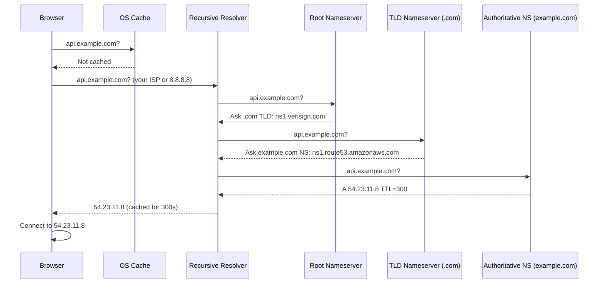

# DNS Deep Dive

## What is DNS

DNS (Domain Name System) is the internet's phone book — it translates human-readable hostnames (`api.example.com`) into IP addresses (`54.23.11.8`) that machines can route to.

Without DNS, you'd need to memorize IPs. With DNS, names are stable even when IPs change (just update the record).

---

## DNS Record Types

| Record | Purpose | Example |
|---|---|---|
| **A** | Hostname → IPv4 address | `api.example.com → 54.23.11.8` |
| **AAAA** | Hostname → IPv6 address | `api.example.com → 2001:db8::1` |
| **CNAME** | Alias → another hostname | `www.example.com → example.com` |
| **MX** | Mail server for domain | `example.com → mail.example.com` (priority 10) |
| **TXT** | Arbitrary text | SPF, DKIM, domain verification |
| **NS** | Nameservers for domain | `example.com NS → ns1.route53.com` |
| **SOA** | Start of Authority — zone metadata | Serial number, TTL defaults |
| **PTR** | Reverse DNS (IP → hostname) | `8.11.23.54.in-addr.arpa → api.example.com` |
| **SRV** | Service location (host + port) | `_http._tcp.example.com → 10 5 8080 server1.example.com` |
| **CAA** | Which CAs can issue certs | `example.com CAA → letsencrypt.org` |

### A vs CNAME

```
# A record: points directly to IP
api.example.com.   300   IN   A   54.23.11.8

# CNAME: alias — must resolve CNAME first, then resolve that hostname
www.example.com.   300   IN   CNAME   example.com.
example.com.       300   IN   A       54.23.11.8
```

**CNAME can't coexist with other records at the same name.** You can't have both `example.com CNAME` and `example.com MX` — this is why apex domains (naked `example.com`) can't use CNAME. Use ALIAS/ANAME records (Route 53 / Cloudflare flatten CNAME at zone apex).

---

## TTL (Time to Live)

TTL is the number of seconds a DNS response should be cached.

```
api.example.com.   300   IN   A   54.23.11.8
                   ^^^
                   TTL = 300 seconds = 5 minutes
```

**Low TTL (30–60s):** Changes propagate quickly. Good during deployments, failovers. Higher load on authoritative servers.

**High TTL (3600–86400s):** Cached longer, fewer lookups, lower load. Changes take longer to propagate. Good for stable records.

**Rule of thumb:**
- Normal operation: TTL = 300–3600s
- Before a planned change (IP migration): Lower TTL to 60s 24h before
- After change is stable: Raise TTL back

---

## How DNS Resolution Works (Full Walk-Through)

When your browser resolves `api.example.com`:



### The Caching Layers

1. **Browser DNS cache** — Chrome: `chrome://net-internals/#dns`
2. **OS DNS cache** — `/etc/hosts` checked first, then OS cache
3. **Recursive resolver cache** — your ISP's resolver or 8.8.8.8
4. **Authoritative nameserver** — source of truth, no cache

### Iterative vs Recursive Resolution

**Iterative (shown above):** Recursive resolver does all the work, asks each server in turn.

**Recursive:** Each server asks the next server on your behalf. Rarely used today.

---

## DNS Hierarchy

```
.  (Root — 13 root nameserver clusters worldwide)
├── .com  (TLD — operated by Verisign)
│     └── example.com  (Authoritative — you control this)
│           ├── api.example.com   (A record)
│           ├── www.example.com   (CNAME)
│           └── mail.example.com  (MX)
├── .org
├── .io
└── .uk
```

**Root nameservers:** 13 named root servers (a.root-servers.net through m.root-servers.net). Actually hundreds of physical servers via anycast. Operated by ICANN, Verisign, NASA, etc.

**TLD nameservers:** One per top-level domain. Verisign runs `.com` and `.net`. They know which nameservers are authoritative for each domain.

**Authoritative nameservers:** Where you set your actual DNS records. AWS Route 53, Cloudflare, Google Cloud DNS. When you buy `example.com`, you tell the registrar which nameservers are authoritative (NS records at the TLD level).

---

## Zones and Zone Files

A **DNS zone** is the portion of the DNS namespace managed by one organization. A zone file contains all DNS records for that zone.

```bash
# Zone file for example.com
$ORIGIN example.com.
$TTL 300

@        IN  SOA   ns1.example.com. admin.example.com. (
                    2024010101  ; serial
                    3600        ; refresh
                    900         ; retry
                    604800      ; expire
                    300 )       ; minimum TTL

@        IN  NS    ns1.route53.amazonaws.com.
@        IN  NS    ns2.route53.amazonaws.com.

@        IN  A     54.23.11.8
www      IN  CNAME @
api      IN  A     54.23.11.9
mail     IN  MX 10 mail.example.com.
mail     IN  A     54.23.11.10

; TXT records for email authentication
@        IN  TXT   "v=spf1 include:amazonses.com ~all"
```

---

## DNSSEC (DNS Security)

DNS was designed without authentication — anyone can send a forged DNS response (DNS spoofing / cache poisoning).

**DNSSEC** adds cryptographic signatures to DNS records:

1. Zone owner signs all records with a private key
2. Public key published as a DNSKEY record
3. Resolvers verify signatures before trusting responses
4. Chain of trust from root → TLD → zone

**DS record:** Hash of zone's public key, stored at parent (TLD). Creates the chain of trust.

```
Root signs .com's DS record
.com signs example.com's DS record
example.com signs its A records
```

**Not universally adopted:** ~30% of domains use DNSSEC. Adds complexity. Most enterprises use it; many small sites don't.

---

## DNS in System Design

### Service Discovery

In microservices, DNS is often used for service discovery. Kubernetes uses CoreDNS:

```
user-service.default.svc.cluster.local → ClusterIP
```

AWS ECS uses Route 53 private hosted zones for service discovery:
```
user-service.internal → 10.0.1.45 (ECS task IP)
```

Consul (HashiCorp) uses DNS interface for service discovery:
```
user-service.service.consul → healthy instance IP
```

### Load Balancing via DNS (Round Robin)

Return multiple A records for the same hostname. Each client picks a different one.

```
api.example.com   60   A   54.23.11.8
api.example.com   60   A   54.23.11.9
api.example.com   60   A   54.23.11.10
```

Client picks the first one (usually random after the first rotation). Very simple but:
- No health checking (dead servers stay in rotation)
- Client caching means uneven distribution
- TTL must be short for quick failover

**Better:** Use a real load balancer. DNS round-robin is a last resort.

### Failover

Route 53 health checks + failover routing:

```
Primary:   api.example.com → 54.23.11.8 (us-east-1, active)
Secondary: api.example.com → 54.23.11.9 (us-west-2, standby)

Health check: HTTPS GET /health on primary
→ Fails 3 consecutive times → Route 53 switches to secondary
→ TTL must be short (60s) for fast failover
```

### Latency-Based Routing

Route 53 measures latency from multiple regions to client, routes to lowest-latency endpoint:

```
US users   → us-east-1 ALB
EU users   → eu-west-1 ALB  
Asia users → ap-southeast-1 ALB
```

### Geo DNS / GeoDNS

Return different IPs based on client's geographic location:

```
US clients  → 54.23.11.8 (US datacenter)
EU clients  → 54.23.11.9 (EU datacenter, data residency compliance)
```

---

## Split-Horizon DNS (Split-View)

Return different answers for the same hostname depending on where the query comes from.

```
From public internet:  api.example.com → 54.23.11.8 (public IP, via ALB)
From within VPC:       api.example.com → 10.0.1.45  (private IP, direct)
```

**Why:** Avoid traffic going out to internet and back in when both client and server are in the same network.

**AWS implementation:** Route 53 private hosted zones shadow public hosted zones for queries from within the VPC.

---

## DNS Propagation

When you change a DNS record, it doesn't update immediately everywhere.

```
Change A record: 54.23.11.8 → 54.23.11.9

1. Update authoritative nameserver (instant)
2. Recursive resolvers have old value cached until old TTL expires
3. Clients have cached responses until their TTL expires

Propagation time = old TTL value
```

**"DNS propagation" takes 24-48 hours** is a myth. It takes as long as the TTL. If TTL was 300s, propagation is 5 minutes. If TTL was 86400s, up to 24 hours.

**To minimize propagation time:**
1. Lower TTL to 60s at least 24h before the planned change (let old TTL-based caches expire with the new short TTL)
2. Make the change
3. Verify it's correct
4. Raise TTL back to normal after propagation

---

## DNS Caching Pitfalls

### Negative Caching

When a record doesn't exist (`NXDOMAIN`), the negative response is also cached. Duration = SOA `minimum` field (often 300-900s).

If your service is down and returns NXDOMAIN, clients cache that for the negative TTL. Even after you fix it, they'll keep getting NXDOMAIN.

### TTL Ignored by Some Clients

Some HTTP clients, JVM (Java caches DNS aggressively), and mobile apps ignore TTL and cache forever or for a fixed duration. Set `networkaddress.cache.ttl=60` in JVM security properties.

```java
// Set JVM DNS cache TTL
java.security.Security.setProperty("networkaddress.cache.ttl", "60");
java.security.Security.setProperty("networkaddress.cache.negative.ttl", "10");
```

### DNS Amplification Attacks

DNS responses are much larger than requests (query is ~40 bytes, response can be 4000 bytes). Attackers send queries with spoofed source IP (victim's IP) → DNS servers flood victim with amplified responses.

Mitigations: Rate limiting, Response Rate Limiting (RRL) on DNS servers, use TCP for large responses.

---

## Running Your Own DNS

### CoreDNS (Kubernetes)

Go-based DNS server. Plugin architecture. Default DNS server in Kubernetes.

```yaml
# Corefile
.:53 {
    errors
    health
    kubernetes cluster.local in-addr.arpa ip6.arpa {
        pods insecure
        fallthrough in-addr.arpa ip6.arpa
    }
    forward . /etc/resolv.conf    # forward unknown queries to upstream
    cache 30
    loop
    reload
    loadbalance
}
```

### BIND (Berkeley Internet Name Domain)

The classic DNS server. Runs much of the internet's authoritative DNS.

```bash
# Install and run
apt install bind9

# Zone configuration /etc/bind/db.example.com
$TTL 300
@ IN SOA ns1.example.com. admin.example.com. (
    2024010101 3600 900 604800 300)
@ IN NS ns1.example.com.
@ IN A 54.23.11.8
www IN CNAME @
```

### Troubleshooting DNS

```bash
# Basic lookup
dig api.example.com
dig api.example.com A
dig api.example.com @8.8.8.8    # query specific resolver

# Full resolution trace (+trace follows delegation)
dig +trace api.example.com

# Reverse DNS
dig -x 54.23.11.8

# Check TTL (second column in answer section)
dig api.example.com | grep -A5 "ANSWER SECTION"

# Check DNSSEC
dig +dnssec api.example.com

# NS records (who's authoritative?)
dig NS example.com

# Flush OS DNS cache
sudo dscacheutil -flushcache            # macOS
sudo systemd-resolve --flush-caches    # Linux

# Check DNS propagation from multiple locations
# (Use dnschecker.org or)
for server in 8.8.8.8 1.1.1.1 9.9.9.9; do
    echo "From $server:"; dig @$server api.example.com +short
done
```

---

## DNS Numbers to Know

| Metric | Value |
|---|---|
| Root nameservers | 13 (a-m.root-servers.net), hundreds of physical servers via anycast |
| Typical recursive resolution | 20–120ms (uncached) |
| Cached DNS lookup | ~1ms |
| Standard DNS port | 53 (UDP for queries <512 bytes, TCP for large responses) |
| DNS over HTTPS (DoH) | Port 443 |
| DNS over TLS (DoT) | Port 853 |
| Max label length | 63 characters |
| Max hostname length | 253 characters |
| Max UDP DNS packet | 512 bytes (EDNS0 extends to 4096) |


---

## Related

[[07 - Custom Protocols]]
