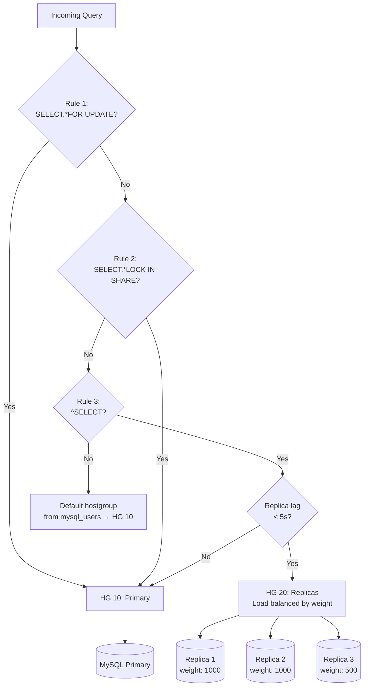

# ProxySQL Query Routing

## Hostgroups — The Foundation of Routing

A **hostgroup** is a group of MySQL servers. Queries are routed to a hostgroup, and ProxySQL picks a server within that group (load balancing).

```sql
-- Typical setup:
-- HG 10: Writer (primary, accepts writes)
-- HG 20: Reader (replicas, reads only)
-- HG 30: Offline (servers being drained/maintained)

INSERT INTO mysql_servers(hostgroup_id, hostname, port, weight, max_connections) VALUES
(10, 'mysql-primary',   3306, 1000, 100),  -- writer hostgroup
(20, 'mysql-replica-1', 3306, 1000, 200),  -- reader hostgroup
(20, 'mysql-replica-2', 3306, 1000, 200),  -- reader hostgroup
(20, 'mysql-replica-3', 3306,  500, 200);  -- reader hostgroup, half weight

-- Within a hostgroup, ProxySQL load-balances by weight
-- replica-1 and replica-2 get 2x traffic of replica-3
```

---

## mysql_query_rules — The Routing Engine

Query rules are evaluated in `rule_id` order. **First matching rule wins.**

```sql
-- Table structure (key columns):
-- rule_id       : evaluation order (lower = higher priority)
-- active        : 1=enabled, 0=disabled
-- match_pattern : PCRE regex applied to query text
-- match_digest  : match against normalized query (parameters stripped)
-- destination_hostgroup : where to send the query
-- apply         : 1=stop evaluating rules, 0=continue to next rule
-- cache_ttl     : cache result for N milliseconds (optional)
-- delay         : add N ms delay (testing, throttling)
-- error_msg     : return this error instead of executing
-- log           : log this query to query log
-- retries       : how many times to retry on connection error
```

### Read/Write Splitting (The Essentials)

```sql
-- Rule 1: Send SELECT queries to replicas (HG 20)
INSERT INTO mysql_query_rules(rule_id, active, match_pattern, destination_hostgroup, apply)
VALUES (1, 1, '^SELECT', 20, 1);

-- Rule 2: Everything else → primary (HG 10)
-- Actually not needed — default_hostgroup in mysql_users handles this
-- But explicit is better:
INSERT INTO mysql_query_rules(rule_id, active, match_pattern, destination_hostgroup, apply)
VALUES (2, 1, '.*', 10, 1);

LOAD MYSQL QUERY RULES TO RUNTIME;
SAVE MYSQL QUERY RULES TO DISK;
```

### Why Simple `^SELECT` Is Insufficient

```sql
-- These are SELECTs but MUST go to primary:
SELECT ... FOR UPDATE            -- locking read, must be on primary
SELECT ... LOCK IN SHARE MODE    -- locking read
SELECT LAST_INSERT_ID()          -- session-specific, must stay on same connection

-- Also: if app just wrote data and immediately reads it,
-- the replica might not have the data yet (replication lag!)
```

### Production-Grade Query Rules

```sql
-- Rule 1: SELECT FOR UPDATE → primary (must be first)
INSERT INTO mysql_query_rules(rule_id, active, match_pattern, destination_hostgroup, apply)
VALUES (1, 1, '^SELECT.*FOR UPDATE', 10, 1);

-- Rule 2: SELECT LOCK IN SHARE MODE → primary
INSERT INTO mysql_query_rules(rule_id, active, match_pattern, destination_hostgroup, apply)
VALUES (2, 1, '^SELECT.*LOCK IN SHARE MODE', 10, 1);

-- Rule 3: Regular SELECTs → replicas
INSERT INTO mysql_query_rules(rule_id, active, match_pattern, destination_hostgroup, apply)
VALUES (3, 1, '^SELECT', 20, 1);

-- Rule 4: BEGIN/START TRANSACTION → stays on primary (connection pinned for transaction)
-- (handled automatically by transaction tracking, but explicit is safer)

-- Rule 5: Everything else → primary
-- (default_hostgroup=10 in mysql_users handles this)
```

### Routing by Schema/Database

```sql
-- Route queries to analytics DB to read-only replicas
INSERT INTO mysql_query_rules(rule_id, active, schemaname, destination_hostgroup, apply)
VALUES (10, 1, 'analytics', 20, 1);

-- Route queries to payments DB to dedicated hostgroup
INSERT INTO mysql_query_rules(rule_id, active, schemaname, destination_hostgroup, apply)
VALUES (11, 1, 'payments', 30, 1);
```

### Routing by User

```sql
-- Create separate user for read-only access
INSERT INTO mysql_users(username, password, default_hostgroup)
VALUES ('readonly_user', 'password', 20);  -- always goes to replicas

-- Regular user: goes to primary by default
INSERT INTO mysql_users(username, password, default_hostgroup)
VALUES ('app_user', 'password', 10);       -- goes to primary

-- But query rules override default_hostgroup:
-- app_user SELECT → rule matches → goes to replica (HG 20)
-- readonly_user SELECT → rule matches → goes to replica (HG 20)
-- app_user UPDATE → no rule matches → goes to primary (HG 10)
-- readonly_user UPDATE → no rule matches → goes to HG 20 → MySQL error (read-only replica!)
```

### Routing by Query Digest (Normalized SQL)

Query digest strips literal values — `WHERE id = 123` becomes `WHERE id = ?`.

```sql
-- Route all order queries matching a specific pattern to a dedicated hostgroup
INSERT INTO mysql_query_rules(
    rule_id, active, match_digest, destination_hostgroup, apply
) VALUES (
    20, 1, 
    '^SELECT .* FROM orders WHERE user_id = ?',  -- digest pattern
    20,  -- replica hostgroup
    1
);

-- Useful for: routing expensive analytics queries to dedicated read replicas
INSERT INTO mysql_query_rules(
    rule_id, active, match_digest, destination_hostgroup, cache_ttl, apply
) VALUES (
    21, 1,
    '^SELECT .* FROM dashboard_stats',
    25,       -- dedicated analytics hostgroup
    60000,    -- cache result for 60 seconds
    1
);
```

---

## Replication-Aware Routing

The biggest challenge with read/write splitting: **replication lag**.

```
App writes: UPDATE orders SET status='shipped' WHERE id=1
→ Written to primary immediately

App reads:  SELECT status FROM orders WHERE id=1
→ Routed to replica
→ Replica hasn't received the update yet (lag = 500ms)
→ App gets status='pending' → BUG
```

### Solution 1: Replication Hostgroups (Built-in Lag Detection)

```sql
-- Tell ProxySQL about primary/replica relationship
INSERT INTO mysql_replication_hostgroups(writer_hostgroup, reader_hostgroup, comment)
VALUES (10, 20, 'primary-replica replication');

-- ProxySQL monitors SHOW SLAVE STATUS on replicas
-- If Seconds_Behind_Master > max_replication_lag, server moves to SHUNNED
UPDATE global_variables 
SET variable_value = '5'   -- shun replicas lagging more than 5 seconds
WHERE variable_name = 'mysql-monitor_replication_lag_interval';

LOAD MYSQL VARIABLES TO RUNTIME;
```

### Solution 2: Transaction Tracking — After-Write Reads

ProxySQL can route reads to primary for a period after a write in the same connection:

```sql
-- Configure transaction isolation for read/write split
-- If the connection just wrote, route next N reads to primary
UPDATE global_variables 
SET variable_value = '1' 
WHERE variable_name = 'mysql-use_rw_splitting_regex_cache';

-- Or in query rules: use session_cache for post-write reads
```

### Solution 3: Application-Level Hint

Mark critical reads to go to primary:

```sql
-- In app code, add a comment hint:
SELECT /* PRIMARY */ * FROM orders WHERE id = 1;

-- Query rule to route commented queries to primary:
INSERT INTO mysql_query_rules(rule_id, active, match_pattern, destination_hostgroup, apply)
VALUES (5, 1, '/\* ?PRIMARY \*/', 10, 1);
```

### Solution 4: Sticky Sessions After Write

```kotlin
// Kotlin example: force primary reads after a write
class OrderService(
    private val dataSource: DataSource  // points to ProxySQL
) {
    fun shipOrder(orderId: Long) {
        dataSource.connection.use { conn ->
            conn.prepareStatement(
                "/* PRIMARY */ UPDATE orders SET status='shipped' WHERE id=?"
            ).use { stmt ->
                stmt.setLong(1, orderId)
                stmt.executeUpdate()
            }
            // Next read must use primary too — same connection is still routed there
            conn.prepareStatement(
                "/* PRIMARY */ SELECT status FROM orders WHERE id=?"
            ).use { stmt ->
                stmt.setLong(1, orderId)
                stmt.executeQuery()
            }
        }
    }
}
```

---

## Query Caching

ProxySQL can cache query results in memory:

```sql
-- Cache all dashboard queries for 30 seconds
INSERT INTO mysql_query_rules(
    rule_id, active, match_digest, cache_ttl, apply
) VALUES (
    100, 1, 
    '^SELECT .* FROM dashboard',
    30000,  -- 30 seconds in milliseconds
    1
);

-- Check cache hits
SELECT * FROM stats_mysql_query_digest 
WHERE digest_text LIKE '%dashboard%'
ORDER BY count_star DESC;
-- Look for cache_hit column
```

**Cache limitations:**
- In-memory only (not distributed across ProxySQL instances)
- No invalidation on write — TTL only
- Not suitable for data that changes frequently
- Suitable for: dashboards, aggregations, reference data

---

## Load Balancing Within a Hostgroup

```sql
-- Weight-based (default): servers with higher weight get more traffic
INSERT INTO mysql_servers(hostgroup_id, hostname, port, weight) VALUES
(20, 'replica-1', 3306, 1000),  -- 50% traffic
(20, 'replica-2', 3306, 1000),  -- 50% traffic  
(20, 'replica-3', 3306,  500);  -- 25% traffic (lower weight)

-- max_replication_lag: shun replica if lag exceeds this (seconds)
UPDATE mysql_servers 
SET max_replication_lag = 10  -- shun if >10 seconds behind
WHERE hostgroup_id = 20;
```

### Server Status Values

```sql
SELECT hostname, status FROM mysql_servers;

-- ONLINE:  healthy, receiving traffic
-- SHUNNED: temporarily removed (high replication lag, too many errors)
-- OFFLINE_SOFT: draining (no new connections, existing ones finish)
-- OFFLINE_HARD: completely removed (no connections allowed)
```

---

## Visualizing the Routing Flow



---

## Debugging Routing Decisions

```sql
-- See which rule matched each query
SELECT 
    hostgroup,
    sum_time,
    count_star,
    rule_id_matched,
    digest_text
FROM stats_mysql_query_digest
ORDER BY sum_time DESC
LIMIT 20;

-- If rule_id_matched = -1: no rule matched, used default_hostgroup
-- If rule_id_matched = N: rule N matched

-- Enable query logging temporarily
UPDATE global_variables 
SET variable_value = '1'
WHERE variable_name = 'mysql-eventslog_format';
-- Logs all queries to /var/lib/proxysql/proxysql_queries.log

-- Test a rule without applying
-- Check stats after enabling a new rule:
SELECT * FROM stats_mysql_query_rules WHERE rule_id = 5;
-- hits: how many times this rule was triggered
```
