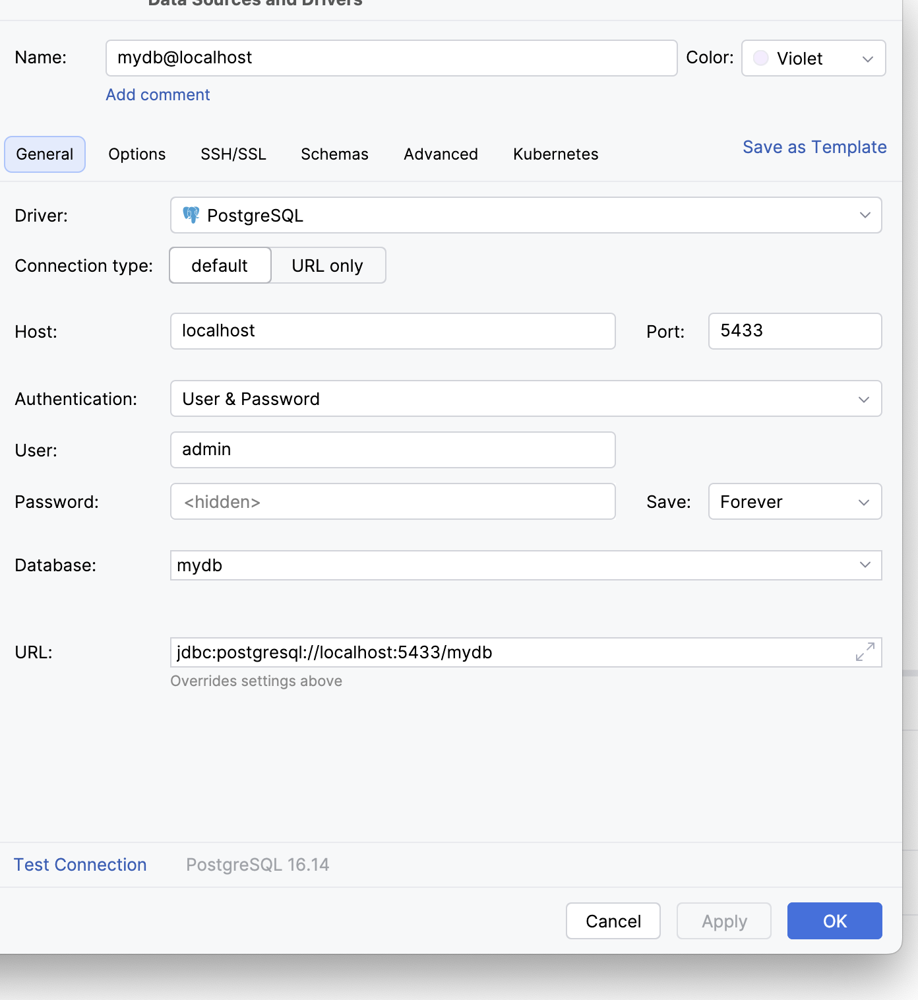

### Setup docker
```
docker run --name my-postgres \
  -e POSTGRES_USER=admin \
  -e POSTGRES_PASSWORD=secret \
  -e POSTGRES_DB=mydb \
  -p 5433:5432 \
  -d postgres:16
```

### Connect to DB
```agsl
docker exec -it my-postgres psql -U admin -d mydb
```

### intellij



### show databases
```agsl
SELECT datname FROM pg_database;
```